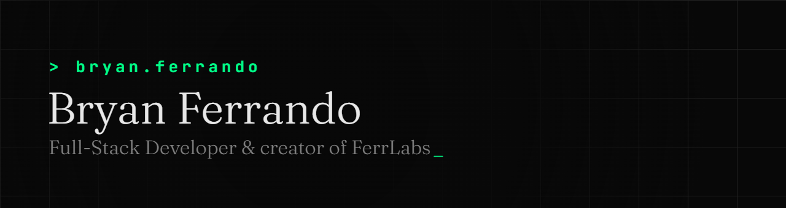

Full-stack developer. Apprentice at Magellan on public sector software, MSc student at Epitech.
I build developer tooling under [FerrLabs](https://github.com/FerrLabs), usually because the tool
I wanted did not exist yet.

## What I build

| Project | What it does |
| --- | --- |
| [FerrFlow](https://ferrflow.com) | Universal semantic versioning. One Rust binary reads your commits, bumps 16 version file formats, writes the changelog and cuts the release. |
| [LFSX](https://lfsx.dev) | A fast, lightweight, secure Git LFS server, self-hostable, with GitHub-backed auth. |
| [IdleWarden](https://idlewarden.com) | Extensible automation platform for single-player idle games on Windows. Plugins, signed updates, no anti-cheat circumvention. |
| [FerrGames](https://ferrgames.com) | Multiplayer party games in the browser. No install, no account, open a room and share the link. |
| [Portfolio](https://github.com/BryanFRD/Portfolio) | This website: Angular SSR frontend, Rust API, shipped to my cluster by GitOps. |

## Stack

Rust and Axum on the backend, TypeScript with Angular or React on the frontend, Java and C# when
the project calls for it. PostgreSQL, Docker, Kubernetes reconciled by Flux.

## Elsewhere

- [bryan-ferrando.fr](https://bryan-ferrando.fr) for the full portfolio
- [linkedin.com/in/bryan-ferrando](https://www.linkedin.com/in/bryan-ferrando/)
